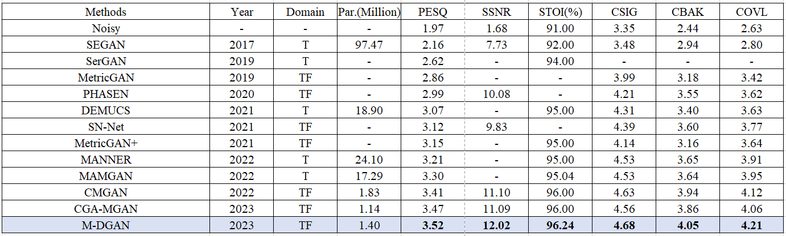

# M-DGAN: CRC-based GAN speech enhancement structure with magnitude and phase representations in mixed T-domain and TF-domain
## Abstract:
Speech enhancement, crucial for improving speech signal quality in noisy conditions, has seen significant advancements with deep learning. This paper introduces a novel approach that integrates a T-domain residual noise estimation encoder-decoder structure into the TF-domain generator framework, based on the generative adversarial networks speech enhancement framework. The proposed mixed T-domain and TF-domain generator, incorporating the cascaded reworked conformer (CRC) structure, exhibits improved modeling capability and adaptability. Test results on the Voice Bank+DEMAND public dataset show that our method achieves the highest score with PSEQ=3.52 and performs well on all the remaining metrics when compared to the current state-of-the-art methods.

## Using this code:

### Installation & Enviornment

The OS, python and pytorch version needs as below:
- Windows
- Linux : you should change audio_backend to "sox_io"
- python >= 3.8
- pytorch == 2.0.1
- torchaudio == 2.0.2

you can install this through src/requirements.txt

In src:

```pip install -r requirements.txt```

### Dataset
Download VCTK-DEMAND dataset https://datashare.ed.ac.uk/download/DS_10283_1942 or latest version https://datashare.ed.ac.uk/handle/10283/2791
#### 1.Dataset Catalog Structure
change the dataset dir:
```
-dataset/
  -train/
    -noisy/
    -clean/
  -test/
    -noisy/
    -clean/
```
#### 1.Downsample

The sample rate of the dataset is 48kHz.

we should downsample the audio files from 48kHz to 16kHz.

run this code in Git bash
```
sr.sh
```
- In the ```sr.sh``` script, you should change the contents as follows.
  
```
input_folder='The original path'
output_folder='The 16khz path'
```
Notice that if you use windows you should install "sox"
### Train & Evaluation

You can train M-DGAN with the default setting by running the following code.

```
python train.py --data_dir <dir to dataset>
```

you can evaluation with the best model:
```
python evaluation.py --dtest_dir <dir to dataset> --model_path './best_model/best'
```
## Result:


